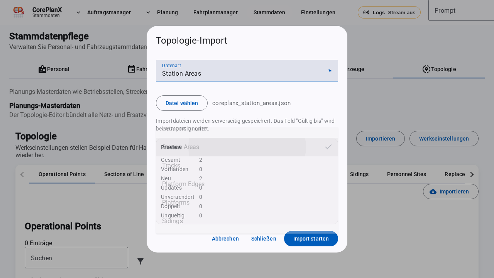
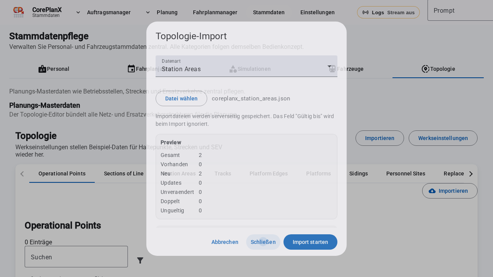

# Stammdaten · Topologie

Diese Seite beschreibt die Topologie-Stammdaten (Netzmodell) in CorePlanX.
Sie ist als Referenz fuer den CorePlanX Assistant gedacht.

## Wo finde ich das?

Navigation:

- **Stammdaten → Topologie**
- Tabs:
  - **Operational Points**
  - **Sections of Line**
  - **Station Areas**
  - **Tracks**
  - **Platform Edges**
  - **Platforms**
  - **Sidings**
  - **Personnel Sites**
  - **Replacement Stops**
  - **Replacement Routes**
  - **Replacement Edges**
  - **OP ↔ Replacement Links**
  - **Transfer Edges**

## Überblick

Die Topologie bildet das Netzmodell, auf das andere Bereiche zugreifen:

- **Operational Points** sind die Knoten im Netz (Betriebsstellen/Orte).
- **Sections of Line** verbinden zwei Operational Points (Kanten im Netz).
- **Personnel Sites** sind Einsatzstellen fuer Personal (Heimdepots, Pausenorte).
- **Replacement-Entitaeten** modellieren Ersatzverkehr (SEV).
- **Transfer Edges** beschreiben Umsteige-/Wegezeiten zwischen Knoten.

Alle Tabs nutzen den Attribut-Editor: zusaetzliche Felder koennen als **Custom Attributes** gepflegt
werden (teilweise mit `validFrom` fuer gueltig-ab).

## Import (globaler Dialog)

Der Import erfolgt zentral über **Importieren** im Topologie-Header. Der Dialog deckt aktuell
Operational Points, Sections of Line, Station Areas, Tracks, Platform Edges, Platforms und Sidings ab.

### Ablauf

1. **Datenart** wählen (z. B. Station Areas).
2. JSON-Datei auswählen (Array oder `{ "items": [...] }`).
3. Preview prüfen (Neu/Update/Unverändert, Doppelte IDs, Ungültige IDs, Beispiel-Diffs).
4. **Import starten**.

### Preview & Duplikate

- Import wird blockiert, wenn doppelte oder ungültige IDs im Upload sind.
- Vorhandene Einträge werden erkannt; Unterschiede werden als Diff-Beispiele angezeigt.
- Felder wie `validTo`/`validUntil` werden beim Import ignoriert (historische Werte).

### JSON-Format

- **Liste**: `[ { ... }, { ... } ]`
- **Container**: `{ "items": [ { ... }, ... ] }`

## Screenshots

## Operational Points

### Feldlexikon

| Feld | Typ | Zweck | Pflicht |
| --- | --- | --- | --- |
| `uniqueOpId` | string | Fachliche ID (eindeutig) | ja |
| `name` | string | Name der Betriebsstelle | ja |
| `countryCode` | string | ISO-Land (z. B. `CH`) | ja |
| `opType` | string | Typ/Klassifikation | ja |
| `lat` | number | Breite (WGS84) | ja |
| `lng` | number | Laenge (WGS84) | ja |
| `attributes` | list | Custom Attributes | nein |

### Regeln & Validierung

- `uniqueOpId`, `name`, `countryCode`, `opType` sind Pflicht.
- `uniqueOpId` muss eindeutig sein.
- `lat`/`lng` muessen numerisch sein.
- Aendern von `uniqueOpId` aktualisiert Referenzen (Sections, Personnel Sites, Replacement Stops,
  OP-Links, Transfer Edges) automatisch.
- Loeschen entfernt referenzierende Eintraege (z. B. Sections) bzw. entkoppelt Felder.

### Import & Tools

- Es gibt einen Import fuer **Operational Points**.
- Ein Konsolenbereich zeigt Status-Events (queued/in-progress/succeeded/failed).
- Nach erfolgreichem Import wird die Liste neu geladen.

## Sections of Line

### Feldlexikon

| Feld | Typ | Zweck | Pflicht |
| --- | --- | --- | --- |
| `startUniqueOpId` | string | Start-OP | ja |
| `endUniqueOpId` | string | End-OP | ja |
| `lengthKm` | number | Laenge in km | nein |
| `nature` | enum | Art (`REGULAR`/`LINK`) | ja |
| `attributes` | list | Custom Attributes | nein |

### Regeln & Validierung

- Start- und End-OP sind Pflicht und muessen existieren.
- Start und Ende duerfen nicht identisch sein.
- `lengthKm` muss numerisch sein.
- `nature` muss `REGULAR` oder `LINK` sein.

### Import & Tools

- Es gibt einen Import fuer **Sections of Line** mit Live-Log.

## Station Areas

### Feldlexikon

| Feld | Typ | Zweck | Pflicht |
| --- | --- | --- | --- |
| `stationAreaId` | string | Eindeutige ID | ja |
| `uniqueOpId` | string | OP-Referenz (optional) | nein |
| `name` | string | Bereichsname | nein |
| `position` | object | `{ lat, lng }` WGS84 | nein |
| `attributes` | list | Custom Attributes | nein |

### Regeln & Validierung

- `stationAreaId` muss eindeutig sein.
- Wenn `uniqueOpId` gesetzt ist, muss der OP existieren.
- `position.lat`/`position.lng` muessen numerisch sein.

## Tracks

### Feldlexikon

| Feld | Typ | Zweck | Pflicht |
| --- | --- | --- | --- |
| `trackKey` | string | Eindeutiger Schlüssel | ja |
| `trackId` | string | Fachliche Gleisnummer | nein |
| `uniqueOpId` | string | OP-Referenz (optional) | nein |
| `platformEdgeIds` | list | Platform-Edge-IDs | nein |
| `attributes` | list | Custom Attributes | nein |

### Regeln & Validierung

- `trackKey` muss eindeutig sein.
- `platformEdgeIds` sollten existierende Platform Edges referenzieren.
- Wenn `uniqueOpId` gesetzt ist, muss der OP existieren.

## Platform Edges

### Feldlexikon

| Feld | Typ | Zweck | Pflicht |
| --- | --- | --- | --- |
| `platformEdgeId` | string | Eindeutige Kanten-ID | ja |
| `platformId` | string | Fachliche Bahnsteig-ID | nein |
| `platformKey` | string | Plattform-Schlüssel | nein |
| `trackKey` | string | Zugeordnetes Gleis | nein |
| `lengthMeters` | number | Laenge in Metern | nein |
| `platformHeight` | string | Hoehenklasse | nein |
| `attributes` | list | Custom Attributes | nein |

### Regeln & Validierung

- `platformEdgeId` muss eindeutig sein.
- Wenn `trackKey` gesetzt ist, sollte das Gleis existieren.

## Platforms

### Feldlexikon

| Feld | Typ | Zweck | Pflicht |
| --- | --- | --- | --- |
| `platformKey` | string | Eindeutiger Schlüssel | ja |
| `platformId` | string | Fachliche Bahnsteig-ID | nein |
| `uniqueOpId` | string | OP-Referenz (optional) | nein |
| `name` | string | Anzeigename | nein |
| `lengthMeters` | number | Laenge in Metern | nein |
| `platformHeight` | string | Hoehenklasse | nein |
| `platformEdgeIds` | list | Zugeordnete Kanten | nein |
| `attributes` | list | Custom Attributes | nein |

### Regeln & Validierung

- `platformKey` muss eindeutig sein.
- `platformEdgeIds` sollten existierende Platform Edges referenzieren.

## Sidings

### Feldlexikon

| Feld | Typ | Zweck | Pflicht |
| --- | --- | --- | --- |
| `sidingKey` | string | Eindeutiger Schlüssel | ja |
| `sidingId` | string | Fachliche Abstell-ID | nein |
| `uniqueOpId` | string | OP-Referenz (optional) | nein |
| `lengthMeters` | number | Laenge in Metern | nein |
| `gradient` | string | Steigung/Gefaelle | nein |
| `hasRefuelling` | boolean | Betankung moeglich | nein |
| `hasElectricShoreSupply` | boolean | Landstrom | nein |
| `hasWaterRestocking` | boolean | Wasser | nein |
| `hasSandRestocking` | boolean | Sand | nein |
| `hasToiletDischarge` | boolean | Toilette entleeren | nein |
| `hasExternalCleaning` | boolean | Aussenreinigung | nein |
| `attributes` | list | Custom Attributes | nein |

### Regeln & Validierung

- `sidingKey` muss eindeutig sein.
- Wenn `uniqueOpId` gesetzt ist, muss der OP existieren.

## Personnel Sites

### Feldlexikon

| Feld | Typ | Zweck | Pflicht |
| --- | --- | --- | --- |
| `name` | string | Name der Einsatzstelle | ja |
| `siteType` | enum | Typ (MELDESTELLE, PAUSENRAUM, BEREITSCHAFT, BÜRO) | ja |
| `uniqueOpId` | string | Optionaler OP-Bezug | nein |
| `lat` | number | Breite (WGS84) | ja |
| `lng` | number | Laenge (WGS84) | ja |
| `openingHoursJson` | string | Oeffnungszeiten (JSON) | nein |
| `attributes` | list | Custom Attributes | nein |

### Regeln & Validierung

- `name` ist Pflicht.
- `siteType` muss ein gueltiger Wert sein.
- Wenn `uniqueOpId` gesetzt ist, muss der OP existieren.
- `lat`/`lng` muessen numerisch sein.
- Beim Loeschen werden Transfer Edges, die auf die Site zeigen, entfernt.

### Wegzeiten (Personnel Site ↔ OP)

In der Personnel-Site-Ansicht gibt es eine Umschaltung **"Wegzeiten"**.
Diese pflegt spezielle Transfer Edges (Modus `WALK`) zwischen Site und OP.

**Feldlexikon (Wegzeiten):**

| Feld | Typ | Zweck | Pflicht |
| --- | --- | --- | --- |
| `siteId` | string | Personnel Site ID | ja |
| `uniqueOpId` | string | OP-Referenz | ja |
| `avgDurationSec` | number | Gehzeit in Sekunden | ja |
| `distanceM` | number | Distanz in Metern | nein |

**Regeln:**

- Site und OP muessen existieren.
- `avgDurationSec` muss eine positive Zahl sein.
- Kombination aus Site + OP darf nicht doppelt vorkommen.
- Eintraege werden als **Transfer Edge** mit `mode=WALK` und `bidirectional=true` gespeichert.

## Replacement Stops

### Feldlexikon

| Feld | Typ | Zweck | Pflicht |
| --- | --- | --- | --- |
| `name` | string | Name der Ersatzhaltestelle | ja |
| `stopCode` | string | Code/Kurzname | nein |
| `nearestUniqueOpId` | string | Naechster OP (optional) | nein |
| `lat` | number | Breite (WGS84) | ja |
| `lng` | number | Laenge (WGS84) | ja |
| `attributes` | list | Custom Attributes | nein |

### Regeln & Validierung

- `name` ist Pflicht.
- `lat`/`lng` muessen numerisch sein.
- Wenn `nearestUniqueOpId` gesetzt ist, muss der OP existieren.
- Beim Loeschen werden Replacement Edges, OP-Links und Transfer Edges bereinigt.

### Presets

- Es gibt Bulk-Presets fuer Attribute (z. B. `shelter=Offen`/`shelter=Ueberdacht`).

## Replacement Routes

### Feldlexikon

| Feld | Typ | Zweck | Pflicht |
| --- | --- | --- | --- |
| `name` | string | Linienname | ja |
| `operator` | string | Betreiber | nein |
| `attributes` | list | Custom Attributes | nein |

### Regeln & Validierung

- `name` ist Pflicht.
- Beim Loeschen werden zugeordnete Replacement Edges entfernt.

## Replacement Edges

### Feldlexikon

| Feld | Typ | Zweck | Pflicht |
| --- | --- | --- | --- |
| `replacementRouteId` | string | Route-Referenz | ja |
| `fromStopId` | string | Start-Stop | ja |
| `toStopId` | string | Ziel-Stop | ja |
| `seq` | number | Reihenfolge innerhalb der Route | ja |
| `avgDurationSec` | number | Fahrzeit (Sek.) | nein |
| `distanceM` | number | Distanz (Meter) | nein |
| `attributes` | list | Custom Attributes | nein |

### Regeln & Validierung

- Route und Stops muessen existieren.
- Start und Ziel duerfen nicht identisch sein.
- `seq` muss eine positive Ganzzahl sein und pro Route eindeutig.
- `avgDurationSec`/`distanceM` muessen numerisch sein (falls gesetzt).

## OP ↔ Replacement Links

### Feldlexikon

| Feld | Typ | Zweck | Pflicht |
| --- | --- | --- | --- |
| `uniqueOpId` | string | OP-Referenz | ja |
| `replacementStopId` | string | Ersatzhalt-Referenz | ja |
| `relationType` | enum | Beziehung (`PRIMARY_SEV_STOP`, `ALTERNATIVE`, `TEMPORARY`) | ja |
| `walkingTimeSec` | number | Fussweg (Sek.) | nein |
| `distanceM` | number | Distanz (Meter) | nein |
| `attributes` | list | Custom Attributes | nein |

### Regeln & Validierung

- OP und Replacement Stop muessen existieren.
- Pro OP+Stop darf es nur einen Link geben.
- `relationType` muss gueltig sein.
- `walkingTimeSec`/`distanceM` muessen numerisch sein (falls gesetzt).

## Transfer Edges

### Feldlexikon

| Feld | Typ | Zweck | Pflicht |
| --- | --- | --- | --- |
| `fromKind` | enum | Knoten-Typ (`OP`, `PERSONNEL_SITE`, `REPLACEMENT_STOP`) | ja |
| `fromRef` | string | ID je nach Typ | ja |
| `toKind` | enum | Knoten-Typ (`OP`, `PERSONNEL_SITE`, `REPLACEMENT_STOP`) | ja |
| `toRef` | string | ID je nach Typ | ja |
| `mode` | enum | Modus (`WALK`, `SHUTTLE`, `INTERNAL`) | ja |
| `avgDurationSec` | number | Dauer in Sekunden | nein |
| `distanceM` | number | Distanz in Metern | nein |
| `bidirectional` | boolean | Rueckweg zulaessig | ja |
| `attributes` | list | Custom Attributes | nein |

### Regeln & Validierung

- `from` und `to` muessen unterschiedliche Knoten sein.
- Referenzen muessen existieren (OP/Site/Stop).
- `mode` muss gueltig sein.
- `avgDurationSec`/`distanceM` muessen numerisch sein (falls gesetzt).
- Beim Loeschen eines referenzierten Knotens werden Transfer Edges automatisch entfernt.

## Praxisbeispiele

- **OP und Strecke anlegen**
  - OPs `OLT` und `ZRH` anlegen → Section of Line `OLT → ZRH` erstellen.
- **Personnel Site mit Wegzeit**
  - Site `Olten Depot` anlegen, danach Walk Time zu `OLT` mit `avgDurationSec=420`.
- **SEV-Linie modellieren**
  - Replacement Stops A/B, Route `SEV 1`, Edge A→B mit `seq=1`.
- **OP ↔ Ersatzhalt verknuepfen**
  - Link `OLT` ↔ `SEV-Olten` als `PRIMARY_SEV_STOP` mit Fussweg 180s.

## Fehlerbilder & Loesungen

- **"Unique OP ID ist erforderlich."**
  - `uniqueOpId` setzen (muss eindeutig sein).
- **"Start- und End-OP muessen gesetzt sein."**
  - Start/Ende aus bestehenden OPs waehlen.
- **"Section of line cannot start and end at the same operational point."**
  - Start und Ende duerfen nicht identisch sein.
- **"Stop-ID ist ungültig."**
  - Replacement Stop existiert nicht oder wurde geloescht.
- **"Sequenz muss eine positive Ganzzahl sein."**
  - `seq` auf 1,2,3,... setzen.
- **"Transfer edge must connect two different nodes."**
  - `from` und `to` muessen unterschiedliche Knoten sein.

## Kontext-FAQ

- **Kann ich `uniqueOpId` aendern?**
  - Ja, Referenzen werden automatisch umgehangen.
- **Warum verschwinden Links nach dem Loeschen eines OPs/Stops?**
  - Abhaengige Kanten/Links werden automatisch bereinigt.
- **Woher kommen die zusaetzlichen Felder?**
  - Aus Custom Attributes (Attribut-Editor), teilweise mit Gueltigkeit ab `validFrom`.

## Abhaengigkeiten & Fluss

- Operational Points → Sections of Line
- Operational Points → Personnel Sites / Replacement Stops / OP-Links
- Personnel Sites → Heimdepots (Stammdaten Personal)
- Replacement Stops/Routes → Replacement Edges
- Topologie → Planung (Gantt, Simulationen, Konflikte, Wegezeiten)

## Datenquellen & Persistenz (technisch)

- Jede Entitaet hat eigene Endpunkte und wird als **Liste** gespeichert:
  - `/planning/topology/operational-points`
  - `/planning/topology/sections-of-line`
  - `/planning/topology/personnel-sites`
  - `/planning/topology/replacement-stops`
  - `/planning/topology/replacement-routes`
  - `/planning/topology/replacement-edges`
  - `/planning/topology/op-replacement-links`
  - `/planning/topology/transfer-edges`
- **Reset:** `POST /planning/topology/reset`
- **Import:** `POST /planning/topology/import` + Events via `/planning/topology/import/events`
